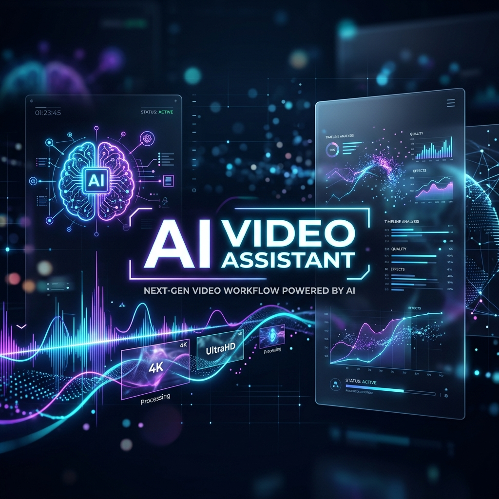

# 📽️ AI Video Assistant



## 🌟 Overview
**AI Video Assistant** is a production-grade intelligence pipeline designed to transform long-form video content into actionable insights. Whether it's a YouTube tutorial, a corporate meeting, or a local lecture, this tool transcribes, summarizes, and indexes the content, allowing you to "chat" with your videos using Retrieval-Augmented Generation (RAG).

Built with a premium **Synapse AI** aesthetic, the application features a polished dark glassmorphism interface that delivers a state-of-the-art user experience.

---

## ✨ Key Features
- **📥 Intelligent Ingestion**: Supports YouTube URLs and local file uploads (MP4, MKV, AVI, etc.).
- **🎙️ Whisper Transcription**: High-accuracy speech-to-text using OpenAI's Whisper models.
- **📝 Map-Reduce Summarization**: Effortlessly summarizes long-form content using Mistral's advanced LLMs.
- **⚡ Actionable Insights**: Automatically extracts:
  - ✅ **Action Items**: Tasks and follow-ups.
  - 📌 **Key Decisions**: Crucial points and conclusions.
  - ❓ **Open Questions**: Unresolved topics or queries.
- **💬 RAG-Powered Chat**: Interactive Q&A system built with **ChromaDB** and **LangChain** to query specific details from the video.
- **🎨 Premium UI**: A stunning Streamlit-based dashboard with glassmorphism, smooth animations, and a modern dark theme.

---

## 🛠️ Tech Stack
- **Frontend**: [Streamlit](https://streamlit.io/) with custom Vanilla CSS (Glassmorphism).
- **LLM**: [Mistral AI](https://mistral.ai/) (via Groq/Mistral API).
- **Transcription**: [OpenAI Whisper](https://github.com/openai/whisper).
- **Vector Store**: [ChromaDB](https://www.trychroma.com/).
- **Embeddings**: [HuggingFace](https://huggingface.co/) (`all-MiniLM-L6-v2`).
- **Orchestration**: [LangChain](https://www.langchain.com/).
- **Processing**: [FFmpeg](https://ffmpeg.org/) for high-performance audio extraction.

---

## 🚀 Getting Started

### Prerequisites
- Python 3.9+
- [FFmpeg](https://ffmpeg.org/download.html) installed and added to your system PATH.
- A Mistral AI API Key.

### Installation
1. **Clone the repository**:
   ```bash
   git clone https://github.com/DevanshPaliwal-19/AI-Video-Assistant-.git
   cd AI-Video-Assistant-
   ```

2. **Set up a virtual environment**:
   ```bash
   python -m venv .venv
   source .venv/bin/activate  # On Windows use `.venv\Scripts\activate`
   ```

3. **Install dependencies**:
   ```bash
   pip install -r Requirements.txt
   ```

4. **Configure environment variables**:
   Create a `.env` file in the root directory:
   ```env
   MISTRAL_API_KEY=your_api_key_here
   WHISPER_MODEL=base
   ```

### Running the App
```bash
streamlit run frontend/app.py
```

---

## 🏗️ Architecture
The pipeline follows a modular sequence:
1. **Extraction**: Audio is stripped from the video and chunked using FFmpeg.
2. **Transcription**: Whisper processes chunks in parallel to generate a full transcript.
3. **Summarization**: Mistral processes the transcript using a map-reduce strategy for long-form context.
4. **Indexing**: The transcript is chunked and embedded into ChromaDB.
5. **Retrieval**: User queries are matched against the vector store to provide context-aware answers.

---

## 📸 Screenshots
*(Coming Soon)*

---

## 🛡️ License
Distributed under the MIT License. See `LICENSE` for more information.

---

## 🤝 Contributing
Contributions are what make the open-source community such an amazing place to learn, inspire, and create. Any contributions you make are **greatly appreciated**.

1. Fork the Project
2. Create your Feature Branch (`git checkout -b feature/AmazingFeature`)
3. Commit your Changes (`git commit -m 'Add some AmazingFeature'`)
4. Push to the Branch (`git push origin feature/AmazingFeature`)
5. Open a Pull Request

---

*Built with ❤️ by [Devansh Paliwal](https://github.com/DevanshPaliwal-19)*
